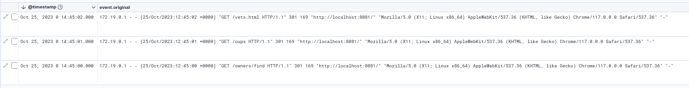
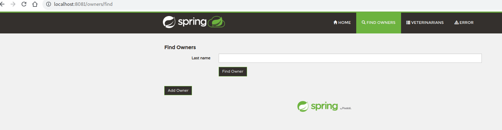
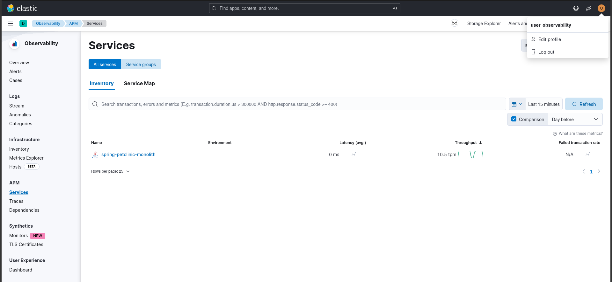

## ONAY Ilker RT3

### 1/ A vous de jouez !

<br>
On peut observer que j'ai un GETS de /vets.html mais par la suite j'obtiens un 301 qui redirige vers http://localhost:8081/ qui est le lien par "défault"
<br>



<br>
Je vérifie mon fichier de configuration dans /elastic-platform/app/conf/default.conf :
<br>
<br>

```
server {
        listen       8081;
        listen [::]:8001;
        server_name  localhost;
        location /intake {
          if ($request_method = 'OPTIONS') {
            # This is a bit too wide, would be enough to replace it with only APM server url for CORS support.
            add_header 'Access-Control-Allow-Origin' '*';
            add_header 'Access-Control-Allow-Methods' 'GET,POST,OPTIONS';
            add_header 'Access-Control-Allow-Headers' 'Accept:,Accept-Encoding,Accept-Language:,Cache-Control,Connection,DNT,Pragma,Host,Referer,Upgrade-Insecure-Requests,User-Agent,elastic-apm-traceparent';
            add_header 'Access-Control-Max-Age' 1728000;
            add_header 'Access-Control-Allow-Credentials' 'true';
            add_header 'Content-Type' 'text/plain; charset=utf-8';
            add_header 'Content-Length' 0;
            return 200;
          }
        }
        location / {
          proxy_pass http://petclinic:8080/;
        }
        location = /owners/find {
          return 301 /#$uri;
        }
        location = /vets.html {
          return 301 /#$uri;
        }
        location = /oups {
          return 301 /#$uri;
        }
        location /nginx_status {
         	stub_status on;
        	allow all; # A bit too wide
         	# deny all;
        }
        error_page   500 502 503 504  /50x.html;
        location = /50x.html {
            root   /usr/share/nginx/html;
        }
    }


```
<br>

Le problème ici quand on mets un # dans une url, tous ce qu'on écrit n'est pas pris en compte par la suite. <br>
On peut observer un "#" dans "/#$uri", mais ce n'est pas le seul problème le "/" derrière les mot owners, vets et oups renverons vers un lien inexistant car le / est déjà préciser au paravant

```
location = /owners/find {
          return 301 /#$uri;
        }
        location = /vets.html {
          return 301 /#$uri;
        }
        location = /oups {
          return 301 /#$uri;
```

Une fois le hashtag et slash enlever du fichier configuration on peut observer que celui-ci renvoie vers le bon lien.



<br>

### 2/ A vous de jouez !

<br>
<ins>Par défault on nous donne ceci : </ins>
<br>

 ```
POST /_security/role/read_observability
{
  "cluster": [],
  "indices": [
    {
      "names": [
        "metricbeat-*",
        "filebeat-*",
        "traces-apm*,apm-*,logs-apm*,apm-*,metrics-apm*,apm-*"
      ],
      "privileges": [
        "read"
      ],
      "allow_restricted_indices": false
    }
  ],
  "applications": [
    {
      "application": "kibana-.kibana",
      "privileges": [
        "feature_logs.read",
        "feature_infrastructure.read",
        "feature_apm.read",
        "feature_uptime.read",
        "feature_observabilityCases.read"
      ],
      "resources": [
        "space:default"
      ]
    }
  ],
  "run_as": [],
  "metadata": {},
  "transient_metadata": {
    "enabled": true
  }
}
 ```


<br>
<br>
Ici on peut observer dans le rôles attribuer qu'on ne respecte pas le fait de lister les droits , donc la personne à qui ont attribuera n'auras pas accès.

Corrigeons celà :

```
  "indices": [
    {
      "names": [
        "metricbeat-*",
        "filebeat-*",
        "traces-apm*",
        "apm-*",
        "logs-apm*",
        "apm-*",
        "metrics-apm*",
        "apm-*"
      ],
```

<br>




<br> 
<br> 

### 3/ A vous de jouez !


